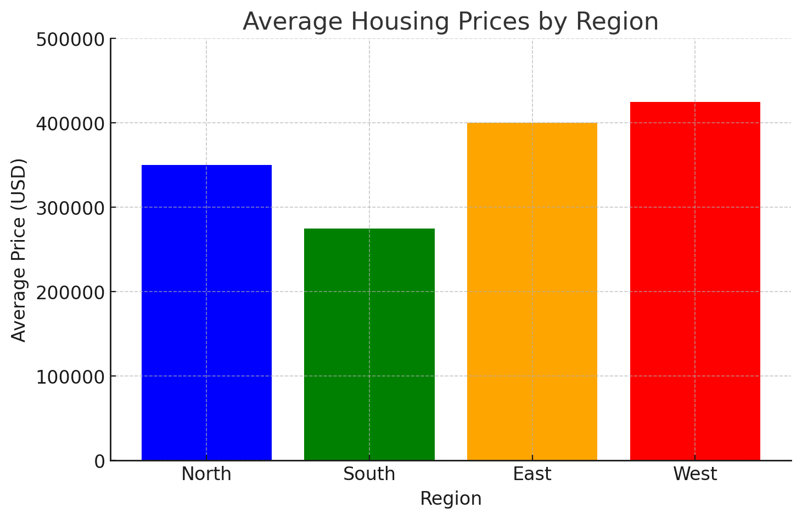

# Policy Bot Template

This repository contains the Policy Bot application, a tool designed to help users interact with and understand organizational policies through a chat interface.

## Repository Structure

- `policy-bot/`: The main application code (a Next.js application)
- `chart.png`: Architecture diagram for the Policy Bot

## Policy Bot

The Policy Bot is a Next.js application that uses AI to help users understand and navigate organizational policies. It provides a chat interface where users can ask questions about policies and receive relevant answers.

For more details about the Policy Bot application, please see the [policy-bot/README.md](policy-bot/README.md).

## Getting Started

To get started with the Policy Bot:

1. Navigate to the `policy-bot` directory
2. Follow the setup instructions in the Policy Bot README

## Architecture

 